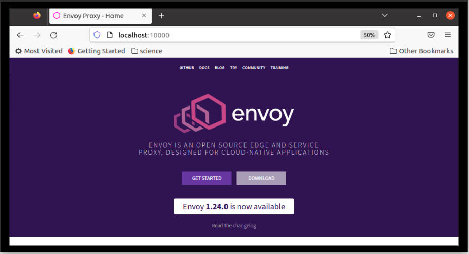
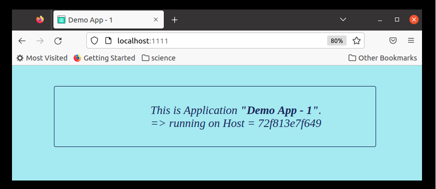
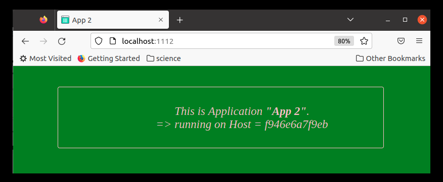
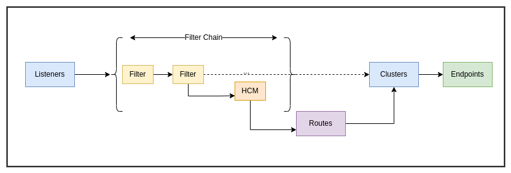
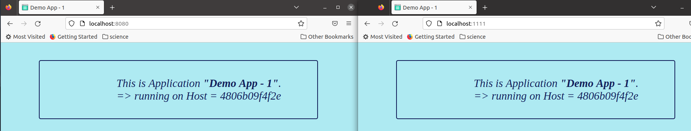
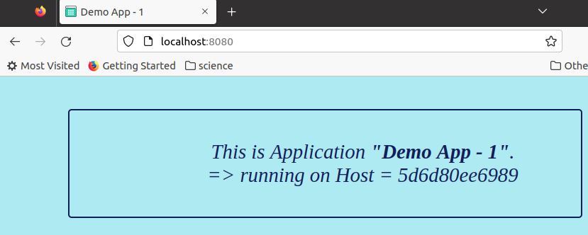
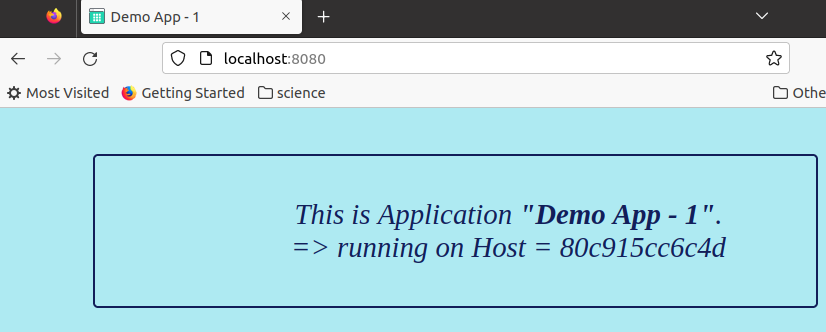
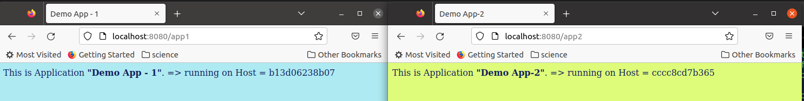
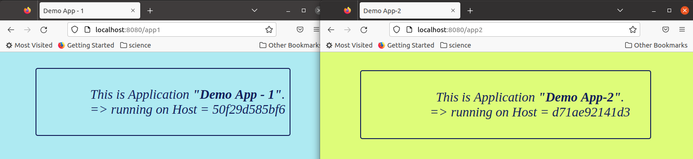
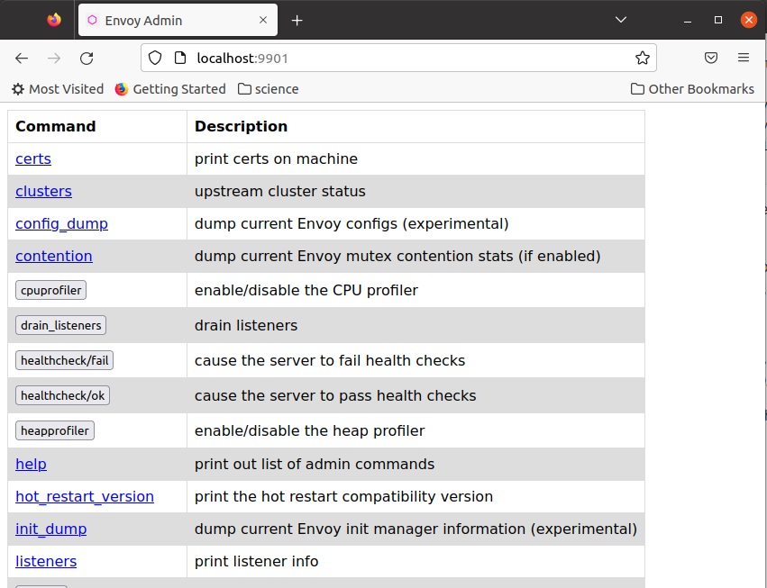

# Sample `Envoy` Configuration Project

### Table of Contents

## Objective

[`Envoy`](#https://www.envoyproxy.io/) is a one of the most popular _proxy_ technology as of this writing, especially in the "_Cloud Native Ecosystem"_. However it does have a bit of a learning curve, and its documentation does not seem to be very beginner friendly. The objective of this project is to provide an introduction to getting started with `Envoy` configuration, and be confident in playing around with it. By the end we hope to be familiar with its _concepts_, _configuration constructs_, and finding our way through their _documentation_.

It is a beginner level project, and we shall restrict our scope to _static configuration_ for now, and cover the following aspects:

- Run `Envoy` using its `Docker` image, and view its _default configuration_
- Understand the _fundamental logical components_ of the `Envoy` architecture
- Start with an _almost empty basic_ configuration
- Work our way through the various capabilities/components such as _load balancing_, _routing_, _access logging_
- Finally look at enabling _Admin API/Interface_

The most important _objective_ is to **enjoy the exploratory process of learning** and gain confidence to dive deeper.

Note: we shall be using `Docker` and `Docker Compose` to do all our exploration, so there is no need to install anything else. This project also includes a **sample configurable web application** written in `Go` that can help us _simulate_ backend/upstream services.

## Running `Envoy` using `Docker`

[`Docker Hub`](#https://hub.docker.com/r/envoyproxy/envoy/tags) provides packaged `Envoy Proxy` images that we can _pull_ and use straight out-of-the-box.

```bash
$ docker pull envoyproxy/envoy:v1.23-latest
```

One thing to note is that `envoyproxy/envoy` does not provide _default_ `latest` _tag_, so I find it more convenient to _re-tag_ it locally.

```bash
# retag envoy image
$ docker tag envoyproxy/envoy:v1.23-latest envoyproxy/envoy

$ docker image ls
REPOSITORY          TAG                 IMAGE ID            CREATED             SIZE
envoyproxy/envoy    latest              71f9c29a67ae        3 weeks ago         132MB
envoyproxy/envoy    v1.23-latest        71f9c29a67ae        3 weeks ago         132MB
```

Now we _run_ this image and _publish_ `port 10000` (as that is the _default_ configured port)

```bash
# run envoy docker image
$ docker run --rm -d --name=envoy -p 10000:10000 envoyproxy/envoy
bfc7c9ab4cd378f0c32a5f3a521f9cf0742067708a1be002ccc632a89f9da9d8
# default port for envoy is 10000, publish to host on same
```

If we use a _browser_ and navigate to `http://localhost:10000` we should see the [`Envoy Proxy`](#www.envoyproxy.io) web home page, as that is the _upstream_ target it gets **_proxied_** to by default.



#### Inside the Container

If we take a look inside the _running container_ it becomes clearer whats happening. We do this using the `docker exec` command.

```bash
# exec into 'evnoy' container 
$ docker exec -it envoy sh 
# check running processes
\# ps -aux
USER         PID %CPU %MEM    VSZ   RSS TTY      STAT START   TIME COMMAND
envoy          1  1.5  0.5 2363152 43748 ?       Ssl  12:35   0:01 envoy -c /etc/envoy/envoy.yaml
# Note the command `envoy -c <pathto config yaml>`
# cehck the config file
\# ls /etc/envoy
envoy.yaml
```

Inside the _container_ we have an `envoy` _process_ started with the `-c` option (which points to the _configuration file_ to be used) with the path as **`/etc/envoy/envoy.yaml`**. This is the file we shall be playing around with throughout the project!

#### Hacking the Default Config

Before we try to systematically learn the configuration, we shall try a simple _hack_, by just copying the `/etc/envoy/envoy.yaml` file from the container to a directory on our host machine, change a few things and then _mount_ that _directory_ back re-launching the container. 

```bash
# create host dir 'proxy'
$ mkdir proxy

# copy envoy-container /etc/envoy/ content to proxy/config
$ docker cp envoy:/etc/envoy/ proxy/config

$ tree
.
├── proxy
│   └── config
│       └── envoy.yaml
└── readme.md
```

Now we have a copy of the file in our `pwd/proxy/config` path. If we open the file up in an editor and take a look it will have lots of details and can be quite intimidating at first!

Without even understanding anything about `Envoy` _configuration_ at this stage let us simply _replace_ the _"occurrences"_ of `www.envoyproxy.io` with `www.google.com`. Don't forget to make a -copy_ of the original _default_ file (in case we break anything and need to start over). 

We are simply _hacking_ around at this stage to see what effect it will have (a snapshot of the modified file can be found in this project as `proxy/config/envoy_google.yaml`). With this change we relaunch the _container_, this time mounting our `/proxy/config` directory as the `/etc/envoy` directory in the container).

```bash
# edit occurances of www.envoyproxy.io with -> www.google.com
$ vim proxy/config/envoy.yaml

# edit, find and replace 

# stop running envoy container
$ docker stop envoy

# run envoy contianer again same as before, but this time mount config from host
$ docker run --rm -d --name=envoy -p 10000:10000 -v $(pwd)/proxy/config:/etc/envoy envoyproxy/envoy
873b22138de171de6989bfbc008830b18868220f11e9e72e0cc57fbc1efce065
```

If we navigate to http://localhost:1000 in the _browser_ again we should now see that we are being _proxied_ to [Google Search](#https://www.google.com)


Now we know that we can use this _approach_ to create our own `envoy.yaml` file and _mount_ it into the `envoyproxy/envoy` _container_ to  control its behaviour with our _custom configuration_.

## Configuration From Scratch

We are now ready to start with the _basic building blocks_ of _configuration_, starting from scratch and work our way up adding different components to it till we get a reasonable working proxy that does useful things.

### Sample Configurable Backend Application

When experimenting with _proxies_ we often need some sort of "_backend_" application/s to act as the target. To help with this I have made a simple _web  application_ in **`Go`** (found in the `web/demoapp`directory). It has a `Dockerfile` to help with _packaging_ it as a `Docker image`. The application is very lightweight; it displays a simple web page with the _Name of the App_, and the _Host_ it is running on. Additionally it has an `api/info` _REST_ endpoint to get further details . By default it runs on `PORT 8080`, but that can be customised via _environment variables_. Since we want to use the same _image_ to _"simulate"_ different applications (or different instances of the _same_ application), the _App Name_, _Background_ and _Foreground_ colours can be customised using _environment variables_ (`APPNAME`, `BGCOLOR`, `FGCOLOR`).

To use it we navigate to the `web/demoapp` directory and build the `Docker` image.

```bash
$ docker build -t demoapp .

$ docker image ls
REPOSITORY                  TAG            IMAGE ID       CREATED         SIZE
demoapp                     latest         1424e02dacf1   1 days ago      13.9MB
```

To launch the app with its _"default setting"_, we simply _run_ the `Docker` image and expose it on a `Port` (let's try `1111`)
```bash
$ docker run --rm --name=demoapp1 -p 1111:8080 demoapp
2022/11/13 17:39:04 *** conf data *** 
 main.configData{AssetsDir:"./assets", TemplatesDir:"./templates", Port:"8080", AppName:"Demo App - 1", BgColor:"#aeeaf2", FgColor:"#121e59"}
2022/11/13 17:39:04 Starting http server on PORT: 8080
```
From our _web browser_ we should now be able to see what our _`demoapp1`_ looks like.



To simulate a different app we can launch another container with a couple of _environment variables_ to customise it.

```bash
$ docker run --rm --name=demoapp2 -p 1112:8080 -e "APPNAME=App 2" -e "BGCOLOR=green" -e "FGCOLOR=pink" demoapp
```
Again from the browser if we go to this `Port` (`1112`), we should see our _`demoapp2`_ displayed as below.



With this we can now simulate different _backends_ (_upstream target_), and we are all set to get started with _configuring_ `Envoy`.

### Basic Components of Envoy Configuration

before we dive into _configuration_ some quick reading up on the _architecture_ and familiarity with its _concepts_ and _terminology_ will be helpful.  There are lost of content on the web that explains this at different levels. One I found to get a quick summary is this one [Getting Started with Envoy in 5 minutes](#https://tetrate.io/blog/get-started-with-envoy-in-5-minutes/)

At the risk of massively _oversimplify_ it. We can think of `Envoy` _configuration_ as consisting of the following components.



- **Listeners** : They represent the `IP` and `Port` where `Envoy` _listens_ for incoming traffic.

- **Filter Chains** : These is a _processing chain_ of _modules_ (_filters_) that have the ability to inspect the traffic (at `L4` layer, or at `L7` layer using the `HTTP Connection manager (HCM)` filter). This provides the _extensibility_ feature of `Envoy` and to me is reminiscent of _"pipes & filters"_ architecture.

- **Routes** : These work with `HCM` filter to decide how we wish to _"route"_ traffic (based on _path_, _prefix_,_headers_ etc.), assign weights to routing etc.

- **Clusters** : They represent the _logical_ _backend_ cluster (app  instances) to which traffic should be routed.

- **Endpoints** : These are the actual _upstream_ targets (with their `IP` or `DNS` name and `Ports` etc.). We use these to also control _load balancing_ etc.

  

  There is so much more detail to each and every one of these and more in terms of _retry_, _circuit-breaking_, _rate-limiting_, _connection pools_, _threads_ etc. However, rather than being overwhelmed by all that, we can start playing around with just this basic understanding, get comfortable with the way it works, and gradually layer on more and more details as we go.

## Configurations (finally)

With all that preparation out of the way we can finally get into the configurations step by step.

### Reverse Proxy Config 

`Envoy` configuration is very powerful in terms of all the options it gives us, however this also makes it quite complex, and difficult to find our way around it. One good way to understand it is to start with a bare-bones _listener_ that does nothing and then start layering functionality bit-by-bit and see what changes we need to do to achieve that. By the end of our journey, we will be more at home with the _configuration_ and more confident in playing around with it.

#### Empty Listener

First, a listener that does nothing! Edit our `prox/config/envoy.yaml` as shown below.
```yaml
static_resources:
  listeners:
  - name: listener_0
    address:
      socket_address:
        address: 0.0.0.0
        port_value: 8080
    filter_chains: [{}]
```
Now Run `Envoy proxy` again with Docker (expose `Port 8080` as that is the listening port we specified in the config above) using the <a id="#envoy-docker-run-mount">following command</a>.

```bash
$ docker run --rm -d --name=envoy -p 8080:8080 -v $(pwd)/proxy/config:/etc/envoy envoyproxy/envoy
```

There is no filter specified, so the reverse-proxy will do nothing, just send an "empty response" back.

```bash
$ curl -v http://localhost:8080

* TCP_NODELAY set
* Connected to localhost (127.0.0.1) port 8080 (#0)
...
* Empty reply from server
```

#### Static Response

As a next step we can add a filter to our listener, specifically an `HTTP` filter and make that respond with a _direct/static response text_. To achieve that we have to expand our `envoy.yaml` config file to add the `filters` and `routes` as shown below:

```yaml
static_resources:
  listeners:
  - name: listener_0
    address:
      socket_address:
        address: 0.0.0.0
        port_value: 8080
    filter_chains: 
      - filters:
        - name: envoy.filters.network.http_connection_manager
          typed_config:
            "@type": type.googleapis.com/envoy.extensions.filters.network.http_connection_manager.v3.HttpConnectionManager
            stat_prefix: http_direct_response
            http_filters:
            - name: envoy.filters.http.router
              typed_config:
                "@type": type.googleapis.com/envoy.extensions.filters.http.router.v3.Router
            route_config:
              virtual_hosts:
              - name: direct_static_response
                domains: ["*"]
                routes:
                - match:
                    prefix: "/"
                  direct_response:
                    status: 200
                    body:
                      inline_string: "Hello from Envoy Proxy!"
```

Whilst it does look quite verbose, at a high level we are adding an `envoy.filters.network.http_connection_manager` in the `filter chain` and to that attaching an `envoy.filters.http.router` filter and a `route config` that describe how to route/handle an `HTTP` request based on the origin (domain/path). In this case we are specifying a _direct inline response string_ instead of an upstream `cluster`. _Later we shall change that to pint to our demo application as the cluster_. The [References](#references) section gives a number of links that I found useful to help us wrap our head around the configuration.

If we restart our `Envoy Docker` container, mounting the directory with the modified `envoy.yaml` (stop the running `Envoy container` then re-run the [command we used previously](#envoy-docker-run-mount)). And try to access that via a browser or `cURL` we should see our _hard coded_ string response from the _proxy_.

```bash
$ curl http://localhost:8080
Hello from Envoy Proxy!
```

#### Proxy to Backend App

The next logical step would be to _route_ the traffic to some _upstream_(backend application). In our case we shall use our `demoapp` application that we wrote. We shall run our `Envoy` proxy and the `demoapp`as `Docker` containers and route traffic the _proxy_ to the _app_. For this to work in `Docker` the _containers_ need a way to discover each other using their '_container name_' (else we will have to keep modifying the `envoy.yaml` config with the dynamically assigned `IP` of the _backend app container_). The simplest way to do this is as follows:

- Create a user-defined `Docker` _network_
- When launching the _containers_, specify a `--name` for the _container_ and attach them to the user-defined _network_ (via the `--net` option)
- Now, container on that _network_ can address each other using the `--anme` specified

```bash
# create docker network
$ docker network create nw_demo_apps

# launch demoapp as app1 into that network
$ docker run --rm --name=app1 -p 1111:8080 --net=nw_demo_apps demoapp
# Note: we have published to localhost:1111, this is just for testing, not needed for the proxy
```

Next we modify our `envoy.yaml` to add a _cluster_ (which points to the above `app1`) specify that _cluster_ as the _upstream_ for the _route config_ in our _listener_.

```yaml
static_resources:
  listeners:
  - name: listener_0
    address:
      socket_address:
        address: 0.0.0.0
        port_value: 8080
    filter_chains: 
      - filters:
        - name: envoy.filters.network.http_connection_manager
          typed_config:
            "@type": type.googleapis.com/envoy.extensions.filters.network.http_connection_manager.v3.HttpConnectionManager
            stat_prefix: http_direct_response
            http_filters:
            - name: envoy.filters.http.router
              typed_config:
                "@type": type.googleapis.com/envoy.extensions.filters.http.router.v3.Router
            route_config:
              virtual_hosts:
              - name: direct_static_response
                domains: ["*"]
                routes:
                - match:
                    prefix: "/"
                  route:
                    cluster: app-one
  clusters:
  - name: app-one
    connect_timeout: 3s
    type: strict_dns
    load_assignment:
      cluster_name: app-one
      endpoints:
      - lb_endpoints:
        - endpoint:
            address:
              socket_address:
                address: app1
                port_value: 8080
```

Note: that in the _cluster_ section the `type: strict_dns` is required if we want it to resolve the DNS name `app1` to its `IP` (I learned that the hard way).

Now we launch the _proxy_ again using the same command we used previously but this time add it to the `nw_dwmo_apps` `Docker` _network_.

```bash
$ docker run --rm -d --name=envoy -p 8080:8080 -v $(pwd)/proxy/config:/etc/envoy --net=nw_demo_apps envoyproxy/envoy
```

Test it out by going to `http://localhost:8080` in your web browser, you should see a web page (served through the _proxy_) showing the name of the application as `Demo App - 1` and the _host_ it is running on (a `Docker` _container id_ in this case). If we access the app container directly using `http://localhost:1111` we should see the exact same page.



##### Docker Compose

Since we will be repeatedly creating & destroying containers to try things out, it makes sense to use `docker-compose` to define our _setup_(_infrastructure_) rather typing out these long _shell commands_ all the time. I have a `setup` directory, with a `docker-compose.yaml` where we shall define our `Docker` setup. The `docker-compose` manifest for our simple setup above, with a single _app_ container and a _proxy_ container attached to a _user-defined network_ looks as shown. It is pretty self explanatory if you are familiar with `docker-compose`.

```yaml
version: "3"
services:
  webapp:
    image: demoapp
    ports:
    - "1111:8080"
    container_name: app1
    networks:
    - envoy_demo_nw
  proxy:
    image: envoyproxy/envoy
    ports:
    - "8080:8080"
    container_name: envoy
    networks:
    - envoy_demo_nw
    volumes: 
    - ../proxy/config:/etc/envoy
networks: 
  envoy_demo_nw:
    ipam:
      driver: default
```

We can execute `$ docker-compose up` (optionally use `-d` flag if we want it to launch it in the background) to bring up all our containers and associated resources and configuration. And, `$ docker-compose down` to bring it down. Note, that we have to run that command from the directory that has the `docker-compose.yaml` file.

From hereon we shall keep modify work with this `docker-compose.yaml` whenever we need to add or change containers to our setup.

#### Load-balancing

Now we shall add two instances of the an app (let's name them `app1-1` and `app1-2`) and modify our `envoy.yaml` config to simulate how multiple requests gets load-balanced between the instances. To achieve this, first we modify our `docker-compose.yaml` to add an additional `service` with the same _image_, so that we have two _containers_ running for the same _app_. Note that we changed the `ports` directive to `expose` , since we do not need to _bind_ them to _host_ anymore, we just need them exposed from the _container_ so that they can be accessed from the `Docker network` they are on.

```yaml
version: "3"
services:
  webapp-1:
    image: demoapp
    expose:
    - "8080"
    container_name: app1-1
    networks:
    - envoy_demo_nw
  webapp-2:
    image: demoapp
    expose:
    - "8080"
    container_name: app1-2
    networks:
    - envoy_demo_nw
  proxy:
    image: envoyproxy/envoy
    ports:
    - "8080:8080"
    container_name: envoy
    networks:
    - envoy_demo_nw
    volumes: 
    - ../proxy/config:/etc/envoy
networks: 
  envoy_demo_nw:
    ipam:
      driver: default
```

Modify the `envoy.yaml`configuration to add an `endpoint` under the `lb_endpoints` section in the `cluster`.

```yaml
static_resources:
  listeners:
 	# not shown here for brevity...
  clusters:
  - name: app-one
    connect_timeout: 3s
    type: strict_dns
    load_assignment:
      cluster_name: app-one
      endpoints:
      - lb_endpoints:
        - endpoint:
            address:
              socket_address:
                address: app1-1
                port_value: 8080
        - endpoint:
            address:
              socket_address:
                address: app1-2
                port_value: 8080

```

With that simple change `Envoy` will load-balance multiple requests(that match the `filter`) between those two`endpoints` in the cluster. Now if we navigate to `http://localhost:8080` in a browser and keep refreshing the page, we should see our familiar web-page (for `Demo App-1`), but the `Host` name should keep alternating between two `Docker` _container Ids_.






Of course this is a very simple demonstration of that capability using the default `round-robin` algorithm (we can control it using the `lb_policy` directive if needed). `Envoy` can do much more complex load-balancing. The [References](#references) section has a link for details on the various types of load-balancing it can do.

#### Routing to Multiple Backends 

So far we have all requests send to the same _backend_ (or _cluster_). Now we shall setup two different apps (`app1` and `app2`) as _backends_ an see how we can _route_ traffic to each. `Envoy` provides so many different _match_ options such as `path`, `prefix`, `headers`, `query_params` etc. to decide how to route traffic ([References](#references) for detailed documentation). In our example we shall keep it simple and just _route_ based on the `prefix` in the `URL`.

To simulate two different apps, we can launch our `demoapp` with some `env` _variables_ to change the _displayed name_, and its _background colour_. We provide these in our modified `docker-compose.yaml`.

```yaml
version: "3"
services:
  webapp-1:
    image: demoapp
    expose:
    - "8080"
    container_name: app1
    networks:
    - envoy_demo_nw
  webapp-2:
    image: demoapp
    expose:
    - "8080"
    container_name: app2
    environment: 
    - APPNAME=Demo App-2
    - BGCOLOR=#defc79
    networks:
    - envoy_demo_nw
  proxy:
    image: envoyproxy/envoy
    ports:
    - "8080:8080"
    container_name: envoy
    networks:
    - envoy_demo_nw
    volumes: 
    - ../proxy/config:/etc/envoy
networks: 
  envoy_demo_nw:
    ipam:
      driver: default
```

It is almost same as before, we simply changed the `container_name` to `app1` and `app2` and add a couple of `env` variables to `app2` to make it look different (_lime_ background colour) and display name as `Demo App-2`.

Then we modify the `envoy.yaml` config to add `app2` as a different _cluster_, then specify a couple of `match` `prefix` directives to _route_ the traffic to the respective cluster.

```yaml
static_resources:
  listeners:
  - name: listener_0
    address:
      socket_address:
        address: 0.0.0.0
        port_value: 8080
    filter_chains: 
      - filters:
        - name: envoy.filters.network.http_connection_manager
          typed_config:
            "@type": type.googleapis.com/envoy.extensions.filters.network.http_connection_manager.v3.HttpConnectionManager
            stat_prefix: http_direct_response
            http_filters:
            - name: envoy.filters.http.router
              typed_config:
                "@type": type.googleapis.com/envoy.extensions.filters.http.router.v3.Router
            route_config:
              virtual_hosts:
              - name: route_app1_app2
                domains: ["*"]
                routes:
                - match:
                    prefix: "/app1"
                  route:
                    cluster: app-one
                - match:
                    prefix: "/app2"
                  route:
                    cluster: app-two
  clusters:
  - name: app-one
    connect_timeout: 3s
    type: strict_dns
    load_assignment:
      cluster_name: app-one
      endpoints:
      - lb_endpoints:
        - endpoint:
            address:
              socket_address:
                address: app1
                port_value: 8080
  - name: app-two
    connect_timeout: 3s
    type: strict_dns
    load_assignment:
      cluster_name: app-two
      endpoints:
      - lb_endpoints:
        - endpoint:
            address:
              socket_address:
                address: app2
                port_value: 8080
```

This should be all that is needed to route traffic to _cluster_ (`app-one` or `app-two`) based on the path _prefix_. And sort of works, if we launch our `docker-compose` now and try to browse `http://localhost:8080/app1` or `http://localhost:8080/app2` we will see our web pages, but without some of the _style_ settings and _favicon_. 



Similarly is we try to access the `http://localhost:8080/app1/api/info` endpoint we will end up the `index.html` page !!!

The issue is that when `Envoy` does a `prefix` `match` for a _route_ it does not seem to _forward_ _"nested"_ paths along (such as `app1/assets/` or `app1/api`). Therefore these paths have to be explicitly specified pointing to the right _cluster_. This can seem repetitive. In our example to make this work we would have to add extra entries in the `routes` section for each _path_. That section of the `envoy.yaml` will now look like.

```  yaml
# ...
            route_config:
              virtual_hosts:
              - name: route_app1_app2
                domains: ["*"]
                routes:
                - match:
                    prefix: "/app1/assets"
                  route:
                    cluster: app-one
                    prefix_rewrite: "/assets"
                - match:
                    prefix: "/app1/api"
                  route:
                    cluster: app-one
                    prefix_rewrite: "/api"
                - match:
                    prefix: "/app1"
                  route:
                    cluster: app-one
                    prefix_rewrite: "/"
                - match:
                    prefix: "/app2/assets"
                  route:
                    cluster: app-two
                    prefix_rewrite: "/assets"
                - match:
                    prefix: "/app2/api"
                  route:
                    cluster: app-two
                    prefix_rewrite: "/api"
                - match:
                    prefix: "/app2"
                  route:
                    cluster: app-two
                    prefix_rewrite: "/"
# ...
```

Also note that we use the `prefix_rewrite` directive to remove the _"prefix"_ part from the request sent to the _upstream_ app. The _prefix_ part is only useful within the context of the _downstream_ and the _proxy_ to determine the _route_. The backend app (`demoapp` in our case) will not know how to handle a request with the _prefix_ path (`app1` or `app2` etc.).

With this modification to our `envoy.yaml` configuration we should be able to successfully route to `app1` or `app2` using a prefix and be able to see the full working application.



##### Regex Match & Rewrite

To me that seems like a lot of repetitive entries, and also seems to need knowledge of the upstream application paths to make it work. Unfortunately I could not find any _"wildcard"_ matching mechanism as far as I know with `Envoy`. 

The next best thing however seems to be to use its _Regex_ matching and rewriting capability. So we shall now modify the `envoy.yaml` config using `safe_regex` _match_ and `regex_rewrite`. The modified `route` section in our `envoy.yaml` with the _Regex_ will look like:

```yaml
static_resources:
  listeners:
  - name: listener_0
    address:
      socket_address:
        address: 0.0.0.0
        port_value: 8080
    filter_chains: 
      - filters:
        - name: envoy.filters.network.http_connection_manager
          typed_config:
            "@type": type.googleapis.com/envoy.extensions.filters.network.http_connection_manager.v3.HttpConnectionManager
            stat_prefix: http_direct_response
            http_filters:
            - name: envoy.filters.http.router
              typed_config:
                "@type": type.googleapis.com/envoy.extensions.filters.http.router.v3.Router
            route_config:
              virtual_hosts:
              - name: route_app1_app2
                domains: ["*"]
                routes:
                - match:
                    safe_regex:
                      google_re2: {}
                      regex: "^\/app1(\/.*)*"
                  route:
                    cluster: app-one
                    regex_rewrite:
                      pattern:
                        google_re2: {}
                        regex: "^\/app1\/(.*)|^\/app1\/"
                      substitution: /\1
                - match:
                    safe_regex:
                      google_re2: {}
                      regex: "^\/app2(\/.*)*"
                  route:
                    cluster: app-two
                    regex_rewrite:
                      pattern:
                        google_re2: {}
                        regex: "^\/app2\/(.*)|^\/app2\/"
                      substitution: /\1
  clusters:
  - name: app-one
    # same as before, not shown for brevity
  - name: app-two
    # same as before, not shown for brevity
```

Now if we test out our _URLs_ `http://localhost:8080/app1` or `app2` in the browser we should see the same result we saw previously. And yes, even though we can avoid the repetition, and reduce the lines of configuration, I think this can get quite complicated and error prone. Error's in _Regexes_ can be infamously hard to test and debug. As a case in point here is a link (https://blog.cloudflare.com/cloudflare-outage/) to a `CloudFlare` outage caused by a badly behaving _Regex_. So be extra cautious when taking this approach. 

#### Access Logs

If we are familiar with other _proxy technologies_ such as `Nginx`, we can usually see the _access logs_ quite readily displayed for all requests received by it. With `Envoy` this is a feature that we can enable with configuration. To do that we simply add a directive `access_log` and include one of the built-in access loggers that come with `Envoy`. To keep things simple we shall use the `stdout` _access logger_, there are many more _loggers_ that can send the output to _files_ or _gRPC_ end points, _open telemetry_ etc. The [References](#references) section gives a link to these in detail. With the `access_log`section added to the `http_connection_manager `  _filter_ our `envoy.yaml` will now look as shown.

```yaml
	filter_chains: 
      - filters:
        - name: envoy.filters.network.http_connection_manager
          typed_config:
            "@type": type.googleapis.com/envoy.extensions.filters.network.http_connection_manager.v3.HttpConnectionManager
            stat_prefix: http_access_log
            access_log:
            - name: envoy.access_loggers.stdout
              typed_config:
                "@type": type.googleapis.com/envoy.extensions.access_loggers.stream.v3.StdoutAccessLog
            http_filters:
            - name: envoy.filters.http.router
```

This should show the access logs in the _default log format_. If we wish to change that we can do so by additional configuration to the `log_format` directive. We shall leave it as the _default_. If we re-launch our setup and browse to our apps via the proxy `http://localhost:8080/app1` or `app2` we should see some _access logs_ in the terminal shown below.

```bash
#...
envoy       | [2022-11-12T12:39:27.201Z] "GET / HTTP/1.1" 404 NR 0 0 0 - "-" "Mozilla/5.0 (X11; Ubuntu; Linux x86_64; rv:107.0) Gecko/20100101 Firefox/106.0" "2407602e-7ce2-4f23-958e-d093d0280188" "localhost:8080" "-"
envoy       | [2022-11-12T12:39:27.278Z] "GET /favicon.ico HTTP/1.1" 404 NR 0 0 0 - "-" "Mozilla/5.0 (X11; Ubuntu; Linux x86_64; rv:107.0) Gecko/20100101 Firefox/106.0" "5b35d29c-2109-4f24-b35b-e0422e420ad3" "localhost:8080" "-"
envoy       | [2022-11-12T12:39:35.562Z] "GET /app1 HTTP/1.1" 200 - 0 2191 6 5 "-" "Mozilla/5.0 (X11; Ubuntu; Linux x86_64; rv:107.0) Gecko/20100101 Firefox/106.0" "daaac977-f0a3-404d-b990-4754c21b6d94" "localhost:8080" "172.19.0.4:8080"
envoy       | [2022-11-12T12:39:35.619Z] "GET /app1/assets/style.css HTTP/1.1" 200 - 0 377 4 4 "-" "Mozilla/5.0 (X11; Ubuntu; Linux x86_64; rv:107.0) Gecko/20100101 Firefox/106.0" "a2433619-11d5-4210-baeb-4c68ffc3affa" "localhost:8080" "172.19.0.4:8080"
envoy       | [2022-11-12T12:39:35.626Z] "GET /app1/assets/favicon.png HTTP/1.1" 200 - 0 555 0 0 "-" "Mozilla/5.0 (X11; Ubuntu; Linux x86_64; rv:107.0) Gecko/20100101 Firefox/106.0" "4f063985-f0df-4ff5-a2a9-720e89bcee16" "localhost:8080" "172.19.0.4:8080"
envoy       | [2022-11-12T12:39:58.878Z] "GET /app2 HTTP/1.1" 200 - 0 2187 1 0 "-" "Mozilla/5.0 (X11; Ubuntu; Linux x86_64; rv:107.0) Gecko/20100101 Firefox/106.0" "73bb6750-2784-4262-9e08-d4b70546cdcf" "localhost:8080" "172.19.0.3:8080"
envoy       | [2022-11-12T12:39:58.924Z] "GET /app2/assets/style.css HTTP/1.1" 200 - 0 377 1 0 "-" "Mozilla/5.0 (X11; Ubuntu; Linux x86_64; rv:107.0) Gecko/20100101 Firefox/106.0" "c94d4f1c-2b21-42f1-8b69-32be864681a6" "localhost:8080" "172.19.0.3:8080"
envoy       | [2022-11-12T12:39:58.928Z] "GET /app2/assets/favicon.png HTTP/1.1" 200 - 0 555 0 0 "-" "Mozilla/5.0 (X11; Ubuntu; Linux x86_64; rv:107.0) Gecko/20100101 Firefox/106.0" "64366834-34a2-4aa0-b013-19d1b15d2c83" "localhost:8080" "172.19.0.3:8080"
```

We can see the _user agent_, _HTTP verb_, _path_, _listener IP_, _upstream IP_, and even a _unique request id_ etc. This can be very useful to debug (troubleshoot). Of course in an actual scenario, the log target would be some _log aggregation_ service like `Splunk` or `DataDog` or `Prometheus/Grafana` etc.

#### Admin API

`Envoy` also provides an _administration API_ that can be used to _view configuration, traffic statistics_, or even _control the behaviour_ of the _proxy server_. To enable this we have to add an extra section in the `envoy.yaml` file.

```yaml
admin:
  address:
    socket_address:
      address: 0.0.0.0
      port_value: 9901
static_resources:
  listeners:
  # ...
```

With that change if we re-launch our `docker-compose.yaml` setup we should be able to make HTTP requests to the _admin_ endpoint (setup as  `localhost:9901` in this case) and see information regarding _listeners_,_clusters_, _endpoints_ etc. We can even get a full `config_dump` (which can be pretty big). There is a `/help` resource that we can query to get all the supported resources/operations.

```bash
$ curl http://localhost:9901/help
admin commands are:
  /: Admin home page
  /certs: print certs on machine
  /clusters: upstream cluster status
  /config_dump: dump current Envoy configs (experimental)
  /contention: dump current Envoy mutex contention stats (if enabled)
  /cpuprofiler: enable/disable the CPU profiler
  /drain_listeners: drain listeners
  /healthcheck/fail: cause the server to fail health checks
  /healthcheck/ok: cause the server to pass health checks
  /heapprofiler: enable/disable the heap profiler
  /help: print out list of admin commands
  /hot_restart_version: print the hot restart compatibility version
  /init_dump: dump current Envoy init manager information (experimental)
  /listeners: print listener info
  /logging: query/change logging levels
  /memory: print current allocation/heap usage
  /quitquitquit: exit the server
  /ready: print server state, return 200 if LIVE, otherwise return 503
  /reopen_logs: reopen access logs
  /reset_counters: reset all counters to zero
  /runtime: print runtime values
  /runtime_modify: modify runtime values
  /server_info: print server version/status information
  /stats: print server stats
  /stats/prometheus: print server stats in prometheus format
  /stats/recentlookups: Show recent stat-name lookups
  /stats/recentlookups/clear: clear list of stat-name lookups and counter
  /stats/recentlookups/disable: disable recording of reset stat-name lookup names
  /stats/recentlookups/enable: enable recording of reset stat-name lookup names

```

We can see our _clusters_ using the `/clusters` resource.

```bash
app-two::observability_name::app-two
app-two::default_priority::max_connections::1024
#... lots more info ...
app-one::observability_name::app-one
app-one::default_priority::max_connections::1024
# ... lost more info ...
```

##### Statistics

We can also get usage statistics using the `/stats` resource.

```bash
$ curl http://localhost:9901/stats
cluster.app-one.assignment_stale: 0
#... lost more info ...
cluster.app-one.external.upstream_rq_200: 3
cluster.app-one.external.upstream_rq_2xx: 3
cluster.app-one.external.upstream_rq_completed: 3
# ...
http.http_access_log.downstream_cx_active: 1
http.http_access_log.downstream_cx_delayed_close_timeout: 0
http.http_access_log.downstream_cx_http1_total: 1
# ...
```

In our example we used `htt_access_log` as the `stat_prefix`, it does not matter what the value is it is just a _string_ to help us filter the `stats` information. 

The setup for _Admin API_ is explained in the link provide in [References](#references). It is not just _API_, the root path for _Admin_ (in our case `http://localhost:9901/`) provides a handy web page as UI that we can use to view all this information visually.



Enabling the _Admin_ endpoint can be very useful, however if enabled it should have **very strong security** protecting that endpoint as it can be used to tap into the _proxy_ and even do destructive _operations_ on it. So use it with caution and following _best practices_. 

As a tool for learning `Envoy`, to peek under the hood and see what is going on with a _request_ it is extremely useful though.

### Next

This concludes our initial foray into configuration of  `Envoy`. The real power of `Envoy`, especially in its use as _service proxy_ comes from its capability to be configured _"dynamically"_. This more advanced capability is supported via  a set of gRPC/REST based configuration provider APIs. These APIs are collectively known as “xDS” (_* Discovery Service_), and this link https://www.envoyproxy.io/docs/envoy/latest/intro/arch_overview/operations/dynamic_configuration is a good starting point to learn more about these.

The next step of the journey to learn `Envoy` would be to setup some _dynamic configuration_, then implement a simple _"control-plane"_, with which we can explicitly change configuration on the fly. However that is a big project in itself, and a story for another time!

<a id="#references">

### References:

</a> 

https://www.envoyproxy.io/docs/envoy/latest/api-v3/extensions/filters/network/http_connection_manager/v3/http_connection_manager.proto

https://tetrate.io/blog/get-started-with-envoy-in-5-minutes/

https://www.envoyproxy.io/docs/envoy/latest/configuration/overview/examples

https://www.envoyproxy.io/docs/envoy/latest/intro/arch_overview/upstream/load_balancing/load_balancers#arch-overview-load-balancing-types

https://www.envoyproxy.io/docs/envoy/latest/api-v3/config/route/v3/route_components.proto#envoy-v3-api-msg-config-route-v3-routematch

https://www.envoyproxy.io/docs/envoy/latest/api-v3/config/accesslog/v3/accesslog.proto#extension-category-envoy-access-loggers

https://www.envoyproxy.io/docs/envoy/latest/start/quick-start/admin#stat-prefix


